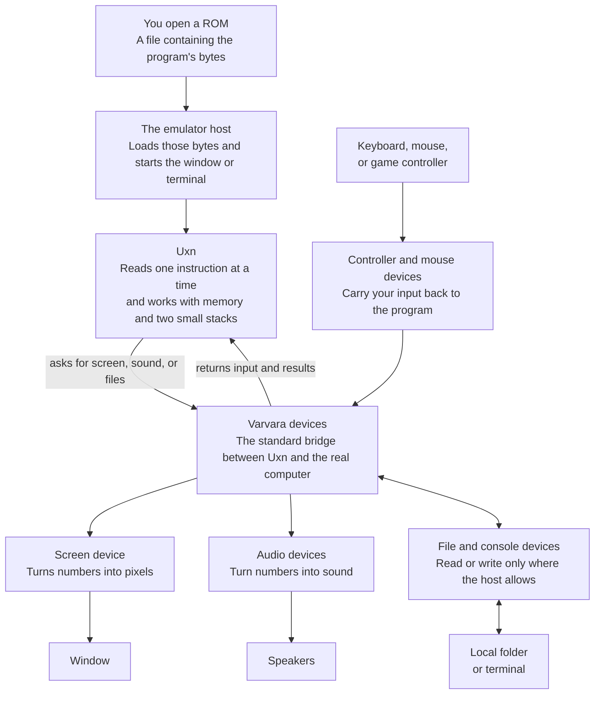

# How the emulator works

The emulator sits between a Uxn program and the real computer. The program
only needs to understand Uxn and Varvara. Our host translates those small,
standard ideas into things the Mac can do.

This separation is why the same ROM can run on different computers. The Uxn
part stays the same. Each emulator only has to translate Varvara's devices into
the window, speakers, controls, and files available on its own machine.
